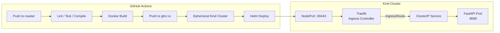

# k8s-microservice-deployment

A Python microservice containerized with Docker and deployed to Kubernetes using Helm — built as a hands-on DevOps project covering the full lifecycle from local development to automated cluster deployment.

---

## :pencil: Overview

The goal was to build something real, not just follow a tutorial. That means: a proper multi-stage Docker image, a Helm chart written from scratch, RBAC configured for service accounts, TLS termination at the ingress, mTLS between pods, and a CI/CD pipeline that tests, builds, and deploys on every push to `master`.

The cluster runs locally via Kind (Kubernetes in Docker), which lets you iterate fast without cloud costs.

---

## :building_construction: Architecture



**Traffic path:** `External → NodePort → Traefik → ClusterIP → Pod`

---

## :wrench: Tech Stack

| Layer | Technology |
|---|---|
| Application | Python 3.11, FastAPI, uvicorn |
| Observability | prometheus-client |
| Containerization | Docker (multi-stage build) |
| Local Kubernetes | Kind (Kubernetes in Docker) |
| Package manager | Helm 3 |
| Ingress | Traefik v3 |
| mTLS | Linkerd |
| TLS | cert-manager + self-signed ClusterIssuer |
| CI/CD | GitHub Actions |
| Container registry | GitHub Container Registry (ghcr.io) |

---

## :open_file_folder: Project Structure

```
.
├── app/
│   └── main.py                    # FastAPI app (/, /health, /metrics)
├── helm/
│   ├── app/                       # Application Helm chart
│   │   └── templates/             # deployment, service, configmap,
│   │                              # namespace, ingressroute, secret
│   └── infra/
│       ├── traefik/               # Traefik ingress controller chart
│       └── cert-manager/          # ClusterIssuer chart
├── k8s-python-api-helm/           # Helm chart used in CI/CD pipeline
├── .github/
│   └── workflows/
│       └── ci-cd.yaml             # CI/CD pipeline definition
├── Dockerfile
└── requirements.txt
```

---

## :rocket: Application Endpoints

| Method | Path | Description |
|---|---|---|
| GET | `/` | Returns app info |
| GET | `/health` | Health check — returns `{"status": "healthy"}` |
| GET | `/metrics` | Prometheus metrics |

---

## :arrows_counterclockwise: CI/CD Pipeline

Three jobs, each depends on the previous:

1. **CI** — syntax compile check (`python -m compileall`), lint (`ruff`), unit tests (`pytest`)
2. **Docker** — multi-stage image build, push to `ghcr.io`
3. **Deploy** — spin up ephemeral Kind cluster, create `dockerconfigjson` pull secret, deploy via Helm, verify rollout

See [CI/CD Pipeline](wiki/ci-cd.md) for job details and required secrets.

---

## :lock: Security

- Non-root container user in Dockerfile
- Pull secrets typed as `kubernetes.io/dockerconfigjson` (not Opaque)
- mTLS between pods via Linkerd
- TLS termination at ingress via cert-manager
- Least-privilege ClusterRole for Traefik Service Account

See [Secret Management](Secret%20strategy.md) for registry secret approach and production alternatives.

---

## :clipboard: Local Setup

Prerequisites: Docker, kubectl, Kind, Helm

```bash
# Create cluster
kind create cluster --name local-dev
kubectl config use-context kind-local-dev

# Create image pull secret
kubectl create secret docker-registry ghcr-secret \
  --docker-server=ghcr.io \
  --docker-username=<user> \
  --docker-password=<token>

# Deploy
helm upgrade --install k8s-python-api ./helm/app \
  --namespace k8s-python-api --create-namespace
```

Full setup steps in [Local Setup](wiki/local-setup.md). Helm chart details in [Helm Chart](wiki/helm-chart.md).

---

## :books: Wiki

| Page | Description |
|---|---|
| [Local Setup](wiki/local-setup.md) | Kind cluster, kubectl, Helm deploy |
| [Helm Chart](wiki/helm-chart.md) | Chart structure, templates, debugging |
| [CI/CD Pipeline](wiki/ci-cd.md) | GitHub Actions jobs, secrets, ephemeral cluster |
| [RBAC & Ingress](wiki/rbac-ingress.md) | Traefik SA, ClusterRole, IngressRoute |
| [TLS & cert-manager](wiki/tls-cert-manager.md) | ClusterIssuer, cert-manager, TLS at ingress |

---

## Author

_Oleksii Akishev_
