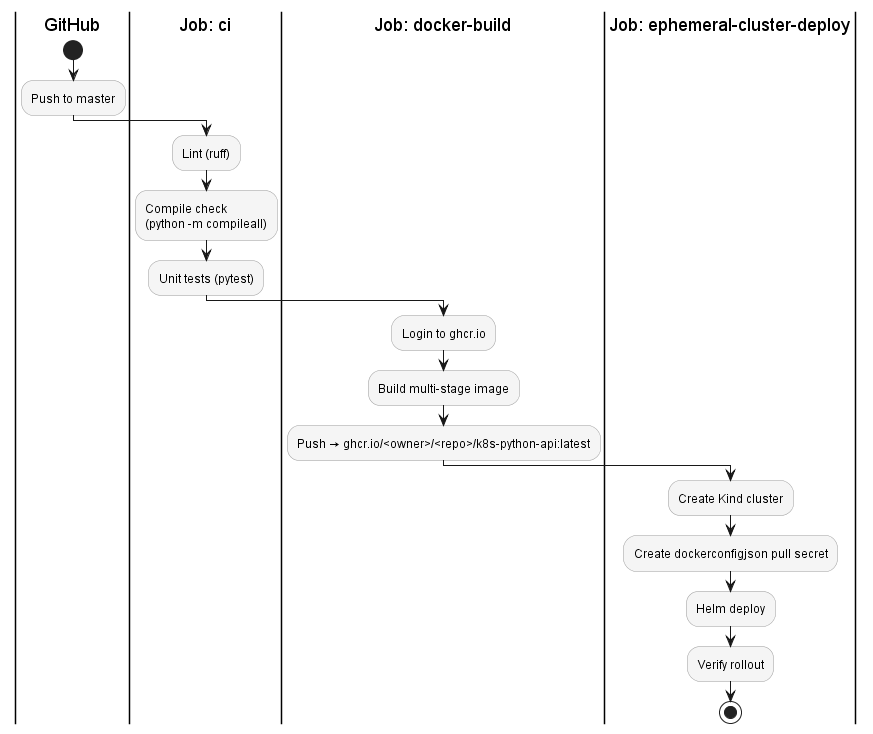
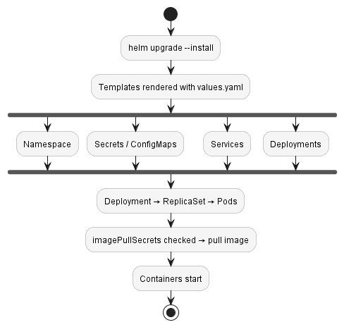

# CI/CD Pipeline

Defined in `.github/workflows/ci-cd.yaml`. Triggers on push or PR to `master`, and supports manual dispatch.

---

## Jobs Overview



---

## Job: CI

```yaml
- python -m compileall .          # catches syntax errors across all .py files
- ruff check .                    # linting
- pytest                          # unit tests
  env:
    PYTHONPATH: .                 # required so pytest finds app/ as a module
```

`__init__.py` in `app/` makes it an explicit Python module. Without it, `pytest` cannot resolve imports from the app directory.

---

## Job: Docker Build

Image tag is set dynamically from the repository path:

```bash
IMAGE_TAG="ghcr.io/${GITHUB_REPOSITORY,,}/k8s-python-api:latest"
```

`${GITHUB_REPOSITORY,,}` lowercases the value - required by ghcr.io (uppercase tags are rejected).

Login uses the `GHCR_TOKEN` repository secret, not `GITHUB_TOKEN`, because the image needs to be pullable from outside the workflow (the Kind cluster in the next job).

---

## Job: Ephemeral Cluster Deploy

A Kind cluster is created fresh on each run - named after the GitHub actor to avoid collisions on concurrent runs:

```bash
CLUSTER_NAME="${GITHUB_ACTOR,,}-kind-cluster"
```

The image pull secret is created with the correct type:

```bash
kubectl create secret docker-registry ghcr-secret \
  --docker-server=https://ghcr.io \
  --docker-username=${{ github.actor }} \
  --docker-password=${{ secrets.GHCR_TOKEN }} \
  --docker-email=${{ github.actor }}@users.noreply.github.com
```

Deploy and verify:

```bash
helm upgrade --install k8s-python-api ./k8s-python-api-helm \
  --set image.repository=$IMAGE_TAG \
  --set image.tag=latest \
  --wait --timeout 120s

kubectl rollout status deployment/k8s-python-api
```

`--wait` makes Helm block until all pods are ready. If the rollout fails within the timeout, the job fails.

---

## Required Secrets

| Secret | Purpose |
|---|---|
| `GHCR_TOKEN` | GitHub PAT with `write:packages` scope - used to push the image in CI and pull it in the cluster |

Set at: `GitHub repo → Settings → Secrets and variables → Actions`

The secret is created as type `kubernetes.io/dockerconfigjson` - not `Opaque`. This is enforced by using `kubectl create secret docker-registry` rather than `secret generic`. A wrong type is silently ignored during image pulls, resulting in a 401 from the registry even when the token is valid. See [Local Setup - Image Pull Secret](local-setup.md#5-image-pull-secret) for details.

---

## Secret Management: Production Considerations

This project uses a long-lived GitHub PAT stored as a repository secret. It works for a portfolio project but has trade-offs at scale. Common improvements in real environments:

| Approach | What it solves |
|---|---|
| **OIDC (Workload Identity)** | Eliminates long-lived PATs entirely - GitHub Actions gets a short-lived token per run via OpenID Connect |
| **Vault / External Secrets Operator** | Centralized secret storage with dynamic injection into pods at runtime, no secrets in etcd |
| **Terraform** | Secret lifecycle managed as IaC alongside the rest of the infrastructure |

For this project the PAT approach is intentional - it keeps the setup self-contained and demonstrates the full secret creation flow explicitly.

---

## Helm Upgrade Flow (what actually happens)

